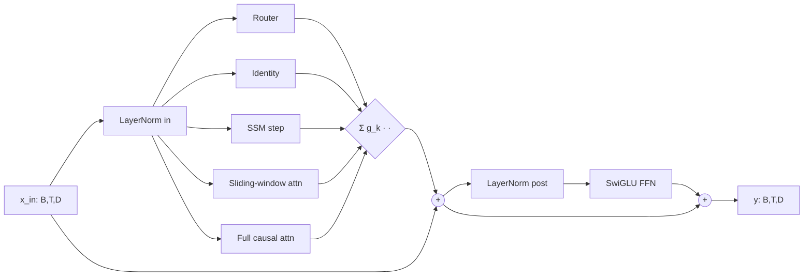
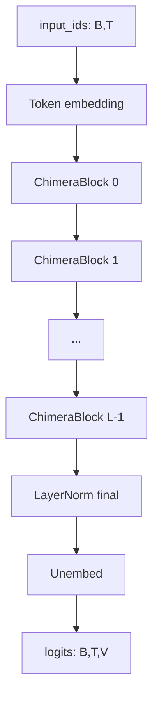

# CHIMERA architecture

## Symbols (global)

| Symbol | Meaning |
|---|---|
| `B`  | batch size |
| `T`  | sequence length |
| `D`  | model hidden dim |
| `H`  | number of attention heads |
| `Dk` | head dim, `D / H` |
| `W`  | sliding-window size (mode 2) |
| `S`  | SSM state size (mode 1) |
| `K`  | number of mixing modes (`= 4` in v1) |
| `L`  | number of layers |
| `V`  | vocabulary size |

## Block diagram

The block is Pre-LN. `LayerNorm in` produces `h = LN(x)` which feeds both the
router and the four mixers. The mixer outputs are combined via the router's
gate (one-hot in hard mode, soft weights in soft mode). The mixed output is
added to `x` (residual), then `LayerNorm post + SwiGLU FFN` and a second
residual produce the block output.

## Tensor shapes through one block (prefill)

| Tensor | Shape | Notes |
|---|---|---|
| `x`                                            | (B, T, D)        | block input |
| `h = LN_in(x)`                                 | (B, T, D)        | router + mixer input |
| `router.weights`                               | (B, T, K)        | soft routing |
| `router.hard_index`                            | (B, T)           | argmax mode |
| `out_0`                                        | (B, T, D)        | identity = `h` |
| `out_1`                                        | (B, T, D)        | SSM output |
| `q, k, v`                                      | (B, T, H, Dk)    | after Q/K/V proj + RoPE |
| `out_2` (sliding-window)                       | (B, T, D)        | causal band attn |
| `out_3` (full causal, mode-3-masked)           | (B, T, D)        | masked to mode-3 subset ∪ self |
| `mixed = Σ_k one_hot_k · out_k`                | (B, T, D)        | gate selection / mix |
| `y = x + mixed; y + FFN(LN_post(y))`           | (B, T, D)        | residual + FFN |

## Tensor shapes through one block (decode at step t)

| Tensor | Shape |
|---|---|
| `x_t`                  | (B, D) |
| `h = LN_in(x_t)`       | (B, D) |
| `router.weights`       | (B, 1, K) |
| `router.hard_index`    | (B, 1) |
| `ssm_state` (cache)    | (B, S) |
| `q_t, k_t, v_t`        | (B, H, Dk) (after RoPE at position `t`) |
| `ring_view_with_current` | (B, Twin, H, Dk), `Twin = min(t+1, W)` |
| `persistent_view_with_current` | (B, Tp+1, H, Dk), `Tp = #mode-3 writes` |
| `out_*`                | (B, D) |

## Mode dispatch (decode)

| Mode | Read source | Write effect |
|---|---|---|
| 0 (identity) | none (output = `h`) | SSM state updated; ring written |
| 1 (SSM)      | post-update SSM state | SSM state updated; ring written |
| 2 (SWA)      | ring ∪ {(k_t, v_t)} | SSM state updated; ring written |
| 3 (full)     | persistent ∪ {(k_t, v_t)} | SSM state updated; ring written; persistent appended |

This is **Resolution A** from spec A.2. Every token writes to ring and SSM
unconditionally so mode-2 queries find a fully populated window. Only mode-3
tokens write to persistent, so the full-attention cache only grows at the
mode-3 rate.

## Composition

The model is a stack of `L` ChimeraBlocks bracketed by a token embedding and
a final-norm + unembed (tied by default).
